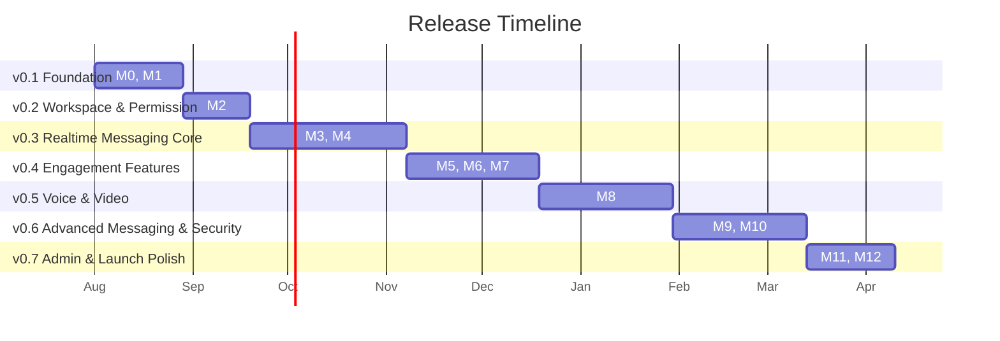

**DEVELOPMENT ROADMAP**
**Discord-Like Web Application — Project-Based Learning**
*Fase 8 — Dokumen tunggal fase ini*
# 1. Pendahuluan
Learning Roadmap (Fase 0) memecah proyek menjadi 13 milestone (M0-M12) berdasarkan tujuan pembelajaran dan estimasi kompleksitas relatif (S/M/L/XL). Development Roadmap ini menerjemahkan milestone tersebut menjadi rencana rilis konkret dengan estimasi durasi kalender, pengelompokan versi (v0.1 - v0.7), serta Definition of Ready/Done di level rilis — sebagai jembatan menuju Sprint Breakdown (Fase 9) dan Task Checklist (Fase 10) yang lebih rinci.
# 2. Asumsi Kapasitas
Proyek dikerjakan oleh satu developer (learner) secara part-time/self-paced, dengan asumsi ketersediaan waktu efektif sekitar 10-12 jam per minggu.
1 minggu kalender diasumsikan setara dengan kompleksitas "S" pada skala Learning Roadmap; pemetaan durasi per milestone pada Bagian 3 diturunkan dari skala kompleksitas tersebut, bukan pengukuran waktu aktual (belum ada data historis kecepatan pengerjaan).
Estimasi durasi bersifat rencana awal (planning estimate) dan akan dikalibrasi ulang setelah beberapa milestone pertama selesai, sejalan dengan sifat proyek pembelajaran yang iteratif.

# 3. Release Plan (Pemetaan Milestone → Versi)
| **Versi** | **Milestone** | **Durasi Estimasi** | **Fokus Utama** |
| --- | --- | --- | --- |
| **v0.1 — Foundation** | **M0, M1** | **4 minggu** | **Tooling, containerization, autentikasi & otorisasi dasar.** |
| **v0.2 — Workspace & Permission** | **M2** | **3 minggu** | **Server/Category/Channel & role/permission granular.** |
| **v0.3 — Realtime Messaging Core** | **M3, M4** | **7 minggu** | **WebSocket foundation, messaging inti, presence, scaling Redis Pub/Sub.** |
| **v0.4 — Engagement Features** | **M5, M6, M7** | **6 minggu** | **Notifikasi, upload & media, pencarian.** |
| **v0.5 — Voice & Video** | **M8** | **6 minggu** | **Integrasi LiveKit end-to-end.** |
| **v0.6 — Advanced Messaging & Security** | **M9, M10** | **6 minggu** | **Forum/Announcement/Poll/Forward/Embed, security hardening penuh.** |
| **v0.7 — Admin & Launch Polish** | **M11, M12** | **4 minggu** | **Admin panel, PWA, responsive polish, validasi scaling teoritis.** |
Total estimasi: 36 minggu (~8-9 bulan pada kapasitas part-time yang diasumsikan), belum termasuk buffer risiko pada Bagian 6.

*Diagram 1 - Release Timeline (Estimasi Minggu Kalender)*

# 4. Detail per Rilis
## v0.1 — Foundation (Minggu 1-4)
Termasuk: M0 (Foundation & Tooling), M1 (Authentication & Authorization Foundation).
Exit Criteria: docker-compose berjalan untuk seluruh service inti; CI lint+build hijau; endpoint register/login berfungsi dengan sesi tersimpan di database.
## v0.2 — Workspace & Permission (Minggu 5-7)
Termasuk: M2 (Workspace Core).
Exit Criteria: CRUD Server/Category/Channel berfungsi; role kustom dapat dibuat & di-assign; permission check aktif pada endpoint channel.
## v0.3 — Realtime Messaging Core (Minggu 8-14)
Termasuk: M3 (Core Messaging Realtime), M4 (Presence & Realtime Scaling).
Exit Criteria: kirim/edit/hapus/reply/mention/reaction pesan berfungsi realtime; presence & typing indicator aktif; broadcast lintas 2 instance aplikasi terbukti bekerja via Redis Pub/Sub (diuji manual pada docker-compose 2 replika).
## v0.4 — Engagement Features (Minggu 15-20)
Termasuk: M5 (Notification System), M6 (File Upload & Media Storage), M7 (Search).
Exit Criteria: notifikasi realtime & email terkirim; upload file hingga 1GB via direct upload Cloudinary; pencarian lintas entitas mengembalikan hasil relevan.
## v0.5 — Voice & Video (Minggu 21-26)
Termasuk: M8 (Voice & Video Channel).
Exit Criteria: join/leave voice & video channel berfungsi end-to-end melalui LiveKit self-hosted; status kehadiran tersinkron dengan Presence.
## v0.6 — Advanced Messaging & Security (Minggu 27-32)
Termasuk: M9 (Advanced Channel & Messaging), M10 (Security Hardening).
Exit Criteria: Forum/Announcement channel, Poll (termasuk dukungan multiple-choice sesuai konfirmasi Database Design/API Specification), Forward, Embed berfungsi; seluruh kontrol keamanan pada Security Design (Fase 6) aktif dan diuji.
## v0.7 — Admin & Launch Polish (Minggu 33-36)
Termasuk: M11 (Admin Panel), M12 (PWA, Responsive Polish & Scalability Validation).
Exit Criteria: Admin Panel berfungsi penuh (manajemen user & audit log); aplikasi installable sebagai PWA; responsif di seluruh breakpoint; evaluasi teoritis strategi scaling terhadap target desain terdokumentasi.

# 5. Definition of Ready & Definition of Done (Level Rilis)
|  | **Kriteria** |
| --- | --- |
| **Definition of Ready (sebelum rilis dimulai)** | **Milestone terkait pada Learning Roadmap telah memiliki SRS-ID, skema database, dan kontrak API yang relevan sudah tersedia (Fase 2, 4, 5); dependency milestone sebelumnya telah selesai.** |
| **Definition of Done (sebelum rilis ditutup)** | **Seluruh Exit Criteria pada Bagian 4 terpenuhi; kode lolos lint (Biome) & lolos pipeline CI; perubahan skema database telah melalui migration review; tidak ada regresi pada fitur rilis sebelumnya (diuji manual, mengingat proyek belum memiliki automated E2E test).** |
# 6. Strategi Risiko & Buffer
Buffer tambahan 15% (≈5 minggu) dialokasikan secara keseluruhan (bukan per rilis), untuk diserap terutama oleh v0.3 dan v0.5 yang secara historis (berdasarkan estimasi kompleksitas L/XL pada Learning Roadmap) paling berisiko molor.
Jika v0.5 (Voice & Video) mengalami hambatan signifikan melebihi buffer, opsi mitigasi adalah menunda fitur video (mempertahankan voice-only) untuk sementara agar rilis berikutnya tidak ikut tertunda, dan menyelesaikan video sebagai iterasi tambahan setelah v0.7.
Kalibrasi ulang estimasi dilakukan setelah v0.1 dan v0.3 selesai (dua titik checkpoint utama), karena keduanya representatif terhadap kecepatan pengerjaan fitur fondasi maupun fitur realtime kompleks.

# Keputusan yang Telah Diambil
13 milestone Learning Roadmap dikelompokkan menjadi 7 rilis (v0.1 - v0.7) dengan estimasi total 36 minggu part-time, ditambah buffer 15%.
Checkpoint kalibrasi ulang estimasi ditetapkan setelah v0.1 dan v0.3.
Definition of Ready/Done level rilis ditetapkan agar setiap rilis memiliki kriteria keluar yang jelas, konsisten dengan Exit Criteria per rilis pada Bagian 4.
Dukungan poll multiple-choice (dikonfirmasi pada Fase 4-5) dijadwalkan masuk pada v0.6 bersama fitur messaging lanjutan lainnya, bukan versi terpisah.
# Keputusan yang Masih Perlu Dikonfirmasi
Apakah buffer 15% dialokasikan merata atau perlu dialokasikan lebih besar secara spesifik ke v0.5 (Voice & Video) mengingat kompleksitasnya yang XL pada Learning Roadmap.
Apakah opsi mitigasi "voice-only dahulu, video menyusul" pada v0.5 dapat diterima sebagai fallback resmi, atau video harus tetap termasuk dalam definisi selesai v0.5 apa pun risikonya.
# Risiko Desain
Estimasi durasi 36 minggu adalah proyeksi awal tanpa data historis kecepatan pengerjaan aktual — berisiko meleset signifikan, terutama untuk v0.3 dan v0.5 yang melibatkan konsep paling baru bagi learner.
Karena proyek dikerjakan solo/part-time, tidak ada redundansi kapasitas — cuti/hambatan pribadi pada satu periode dapat menggeser seluruh rilis berikutnya tanpa mekanisme mitigasi tambahan di luar buffer keseluruhan.
# Technical Debt yang Sengaja Diterima
Belum ada automated E2E test sebagai bagian dari Definition of Done; verifikasi regresi masih manual pada tahap ini, konsisten dengan skala proyek pembelajaran solo.
Roadmap ini belum memasukkan waktu eksplisit untuk dokumentasi ulang (mis. update README, changelog per rilis) — diasumsikan berjalan paralel tanpa alokasi minggu terpisah.
# Pertanyaan untuk Stakeholder Sebelum Melanjutkan ke Fase Berikutnya
Apakah pengelompokan rilis v0.1-v0.7 beserta estimasi durasinya sudah cukup sebagai dasar untuk merinci Sprint Breakdown pada Fase 9?
